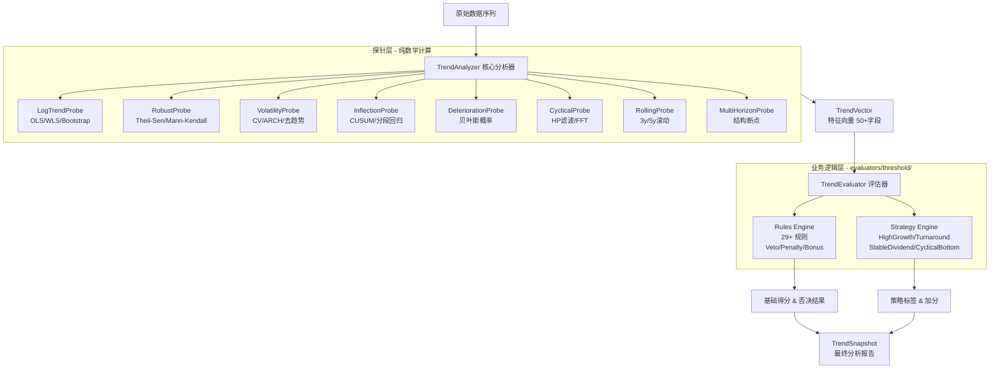

# 趋势分析引擎 (Trend Analysis Engine) v2.0

## 1. 概述 (Overview)

趋势分析引擎是 AStock 系统的**核心基本面量化组件**，负责对上市公司的财务指标（如 ROIC、营收增长率、净利率等）进行深度时序分析。它不仅计算简单的增长率，还通过多维度的探针（Probes）来评估趋势的质量、稳健性、周期性和潜在风险。

**v2.0 专业性增强**：
- 贝叶斯恶化概率：量化基本面风险置信度
- ARCH 效应检测：识别波动聚集性
- WLS 加权最小二乘：处理异方差性
- Bootstrap 置信区间：小样本稳健推断
- 多时间窗口分析：结构断点检测

本模块采用 **Orchestrator-Probe (协调者-探针)** 架构，实现了高内聚、低耦合的设计。

---

## 2. 系统架构 (Architecture)

### 2.1 整体数据流

```
┌─────────────────────────────────────────────────────────────────────────┐
│                        数据流全景图                                      │
├─────────────────────────────────────────────────────────────────────────┤
│                                                                         │
│    原始数据                    探针层                  业务逻辑层         │
│   ┌─────────┐               ┌─────────┐              ┌─────────┐       │
│   │ List[   │               │         │              │ Rules   │       │
│   │ float]  │──┬──────────►│ Probe 1 │────┐         │ Engine  │       │
│   │ (5-10年)│  │           │ (Log)   │    │         │ (29+)   │       │
│   └─────────┘  │           └─────────┘    │         └────┬────┘       │
│                │           ┌─────────┐    │              │            │
│                ├──────────►│ Probe 2 │────┼──►TrendVector│            │
│                │           │ (Robust)│    │              │            │
│                │           └─────────┘    │         ┌────▼────┐       │
│                │           ┌─────────┐    │         │Strategy │       │
│                ├──────────►│ Probe 3 │────┤         │ Engine  │       │
│                │           │(Cyclical)    │         │ (4+)    │       │
│                │           └─────────┘    │         └────┬────┘       │
│                │           ┌─────────┐    │              │            │
│                └──────────►│ ...     │────┘              │            │
│                            │ (8个)   │                   │            │
│                            └─────────┘              ┌────▼────┐       │
│                                                     │Evaluation│      │
│                                                     │ Result   │       │
│                                                     └──────────┘       │
│                                                                         │
└─────────────────────────────────────────────────────────────────────────┘
```

### 2.2 模块交互 (Mermaid)



### 2.3 核心组件详解

#### 协调者层 (Orchestrator) - `core.py`

| 组件 | 职责 | 说明 |
|------|------|------|
| **TrendAnalyzer** | 流程总指挥 | 准备数据、按顺序调用探针、收集结果、生成 TrendVector。**不包含业务规则**，只负责算数 |
| **TrendEvaluator** | 业务评估 | 将 TrendVector 转换为业务结论，依次调用规则引擎和策略引擎 |
| **TrendResultCollector** | 结果汇总 | 将多个指标的分析结果整合成统一的 DataFrame |

#### 探针层 (Probes) - `probes/`

**设计原则**：每个探针只负责计算一类指标，完全不知道"股票"或"ROIC"是什么，只处理 `List[float]`。

| 探针 | 文件 | 输出模型 | 核心算法 |
|------|------|----------|----------|
| **LogTrendProbe** | `log_trend_probe.py` | `LogTrendResult` | OLS + WLS + Bootstrap CI |
| **RobustProbe** | `robust_probe.py` | `RobustTrendResult` | Theil-Sen + Mann-Kendall |
| **VolatilityProbe** | `volatility_probe.py` | `VolatilityResult` | CV + ARCH效应 + 去趋势 |
| **InflectionProbe** | `inflection_probe.py` | `InflectionResult` | CUSUM + 分段线性回归 |
| **DeteriorationProbe** | `deterioration_probe.py` | `RecentDeteriorationResult` | 贝叶斯概率 + 模式识别 |
| **CyclicalProbe** | `cyclical_probe.py` | `CyclicalPatternResult` | HP滤波 + FFT + DFA |
| **RollingProbe** | `rolling_probe.py` | `RollingTrendResult` | 3y/5y 滚动窗口 |
| **MultiHorizonProbe** | `multi_horizon_probe.py` | `MultiHorizonResult` | 结构断点 + Chow检验 |

#### 规则引擎 (Rule Engine) - `evaluators/threshold/rules/`

> ⚠️ **架构说明**: 规则引擎已迁移到 `evaluators/threshold/` 模块，本层 (trend/) 是纯数学层，不包含业务规则。

**职责**: **守门员**，负责定义什么是"不及格"。

**规则分类** (位于 `evaluators/threshold/rules/`):
- **Veto (一票否决)**: `veto.py` - 严重问题直接淘汰
- **Penalty (扣分)**: `penalty.py` - 轻度问题按程度扣分
- **Bonus (加分)**: `bonus.py` - 优秀特征给予奖励
- **Validation (验证)**: `validation.py` - 三表交叉验证

#### 策略引擎 (Strategy Engine) - `evaluators/threshold/strategies.py`

> ⚠️ **架构说明**: 策略引擎已迁移到 `evaluators/threshold/` 模块。

**职责**: **星探**，负责定义什么是"特长生"。

| 策略 | 目标 | 核心逻辑 |
|------|------|----------|
| **HighGrowthStrategy** | 高增长股 | 效率指标高位企稳 或 规模指标高速增长 |
| **TurnaroundStrategy** | 困境反转 | V型反转 + 最新值回到安全线 |
| **StableDividendStrategy** | 稳定分红 | 低波动 + 正斜率 + 高绝对值 |
| **CyclicalBottomStrategy** | 周期底部 | 周期股处于谷底/复苏期 |

---

## 3. 探针详解 (Probes Deep Dive)

### 3.1 LogTrendProbe - 对数趋势分析

**核心功能**：计算趋势斜率、CAGR 和统计显著性。

```python
# 核心算法流程
1. 数据预处理 → log/arcsinh 自适应变换
2. OLS 回归 → slope, intercept, r_squared, p_value
3. WLS 加权回归 → 近期数据权重更大 (处理异方差)
4. Bootstrap CI → 小样本置信区间 (不依赖t分布假设)
```

**v2.0 增强**:

| 特性 | 算法 | 用途 |
|------|------|------|
| **WLS 加权回归** | 指数衰减权重 `exp(0.15 * t)` | 近期数据权重更大，反映时间价值 |
| **Bootstrap CI** | 重采样 100 次 | 小样本下替代 t 分布假设 |
| **自适应变换** | log vs arcsinh 自动选择 | 处理负值和近零值 |

**输出字段 - LogTrendResult**:

| 字段 | 类型 | 含义 |
|------|------|------|
| `log_slope` | float | 对数斜率 (年化增长率近似) |
| `slope` | float | 原始斜率 |
| `r_squared` | float | 拟合优度 (0-1) |
| `p_value` | float | 统计显著性 |
| `std_err` | float | 斜率标准误 |
| `cagr_approx` | float | 复合年增长率近似 |
| `crosses_zero` | bool | 序列是否跨越零 |

### 3.2 RobustProbe - 稳健趋势分析

**核心功能**：使用非参数方法，对异常值免疫。

```python
# Theil-Sen 估算器
- 计算所有点对的斜率，取中位数
- Breakdown point = 29.3%：最多容忍约30%异常值
- 渐近相对效率 ≈ 0.98：接近 OLS 效率

# Mann-Kendall 趋势检验
- 非参数单调趋势检验
- 不假设数据分布 (无正态性要求)
- 基于秩次，对异常值不敏感
```

**学术参考**:
- Sen, P.K. (1968). "Estimates of the Regression Coefficient Based on Kendall's Tau"
- Mann, H.B. (1945). "Nonparametric Tests Against Trend"

**输出字段 - RobustTrendResult**:

| 字段 | 类型 | 含义 |
|------|------|------|
| `robust_slope` | float | Theil-Sen 稳健斜率 |
| `robust_intercept` | float | 稳健截距 |
| `robust_slope_ci_low` | float | 斜率95% CI下界 |
| `robust_slope_ci_high` | float | 斜率95% CI上界 |
| `mann_kendall_tau` | float | Kendall's τ 相关系数 (-1 到 1) |
| `mann_kendall_p_value` | float | 趋势显著性 |

### 3.3 VolatilityProbe - 波动率分析

**核心功能**：评估财务指标的稳定性。

```python
# v2.0 专业增强
1. 变异系数 (CV) = std / mean
2. 去趋势 CV = detrended_std / mean（去除线性趋势后的波动）
3. ARCH 效应检测：大波动后往往跟着大波动
4. 波动率体制分类：stable / increasing_vol / decreasing_vol
```

**ARCH 效应检测原理**:
```python
# ARCH (AutoRegressive Conditional Heteroscedasticity)
# 检测波动率的时间聚集性
changes = np.diff(values)
abs_changes = np.abs(changes)
lag1_corr = pearsonr(abs_changes[:-1], abs_changes[1:])
has_arch = lag1_corr > 0.4  # 正相关表示波动聚集
```

**输出字段 - VolatilityResult**:

| 字段 | 类型 | 含义 | v2.0 |
|------|------|------|------|
| `std_dev` | float | 标准差 | |
| `cv` | float | 变异系数 | |
| `range_ratio` | float | 极差比 | |
| `volatility_type` | str | "low"/"medium"/"high" | |
| `detrended_cv` | float | 去趋势后的CV | ✅ |
| `has_arch_effect` | bool | 是否有波动聚集效应 | ✅ |
| `arch_correlation` | float | ARCH相关系数 | ✅ |
| `volatility_regime` | str | 波动率体制 | ✅ |
| `volatility_change_ratio` | float | 后期/前期波动率比 | ✅ |

### 3.4 InflectionProbe - 拐点检测

**核心功能**：识别趋势的结构性变化。

```python
# 多方法融合
1. 分段线性回归 (Piecewise Linear Regression)
   - 自动寻找最佳分割点
   - F检验验证显著性

2. CUSUM 变点检测
   - Page's CUSUM 算法
   - 检测均值偏移
   - 控制限 = threshold_sigma * sqrt(n)
```

**识别的拐点类型**:

| 类型 | 含义 | 典型场景 |
|------|------|----------|
| `deterioration_to_recovery` | V型反转 | 困境反转 |
| `growth_to_decline` | 倒V型 | 盛极而衰 |
| `acceleration` | 加速增长 | 瞪羚股 |
| `deceleration` | 减速 | 增长见顶 |
| `none` | 无拐点 | 平稳趋势 |

**输出字段 - InflectionResult**:

| 字段 | 类型 | 含义 |
|------|------|------|
| `has_inflection` | bool | 是否存在显著拐点 |
| `inflection_type` | str | 拐点类型 |
| `early_slope` | float | 前期斜率 |
| `recent_slope` | float | 近期斜率 |
| `slope_change` | float | 斜率变化量 |
| `confidence` | float | 拐点置信度 (0-1) |

### 3.5 DeteriorationProbe - 恶化检测

**核心功能**：检测指标近期恶化趋势，识别基本面拐点风险。

```python
# v2.0 贝叶斯恶化概率计算
def calculate_deterioration_probability(
    consecutive_years,    # 连续下跌年数
    acceleration,         # 恶化加速度
    recent_change_pct,    # 近期变化百分比
    total_change_pct,     # 累计变化百分比
):
    # 动态先验
    prior = 0.4 if industry_cyclical else 0.3

    # 似然比更新
    lr_consecutive = {0: 0.5, 1: 1.2, 2: 2.5, 3: 5.0, 4+: 10.0}
    lr_acceleration = f(acceleration)  # 加速恶化 → 高LR

    # 贝叶斯后验
    posterior = prior * lr_all / normalization
```

**恶化模式分类**:

| 模式 | 代码 | 特征 |
|------|------|------|
| 无恶化 | `none` | 无连续下跌 |
| 轻度下滑 | `mild_slip` | 1-2年下跌，幅度<20% |
| 加速恶化 | `accelerating_decline` | 越跌越快 |
| 稳定下跌 | `steady_decline` | 每年相似幅度 |
| 断崖式 | `cliff_drop` | 单年暴跌>30% |

**输出字段 - RecentDeteriorationResult**:

| 字段 | 类型 | 含义 | v2.0 |
|------|------|------|------|
| `has_deterioration` | bool | 是否有恶化 | |
| `severity` | str | "mild"/"moderate"/"severe" | |
| `total_decline_pct` | float | 累计跌幅百分比 | |
| `consecutive_decline_years` | int | 连续下跌年数 | ✅ |
| `deterioration_acceleration` | float | 恶化加速度 | ✅ |
| `deterioration_pattern` | str | 恶化模式分类 | ✅ |
| `deterioration_probability` | float | 贝叶斯恶化概率 (0-1) | ✅ |

### 3.6 CyclicalProbe - 周期性检测

**核心功能**：结合金融计量经济学最佳实践，检测周期性特征。

```python
# 五层方法论
1. Hodrick-Prescott 滤波 (HP Filter)
   - 分离趋势和周期成分
   - 年度数据 λ=6.25 (Ravn & Uhlig, 2002)

2. 自相关分析 (ACF)
   - 周期性序列在滞后k处有正自相关
   - Ljung-Box 检验验证

3. 峰谷检测 + 规则性
   - 峰谷间隔的 std/mean < 0.3 表示规则周期

4. 去趋势波动分析 (DFA)
   - Hurst 指数 H ≈ 0.5 随机游走
   - H < 0.5 均值回复（周期性）
   - H > 0.5 趋势持续

5. 行业先验贝叶斯更新
   - 先验来自 GICS 行业周期性分类
   - 用数据特征更新后验
```

**数据局限性说明**:
```
⚠️ 奈奎斯特定理限制：
- 检测周期T，至少需要 2T 长度数据
- 5年数据最多可靠检测 2-2.5年周期
- 3-7年商业周期需要 10年+ 数据
```

**输出字段 - CyclicalPatternResult**:

| 字段 | 类型 | 含义 |
|------|------|------|
| `is_cyclical` | bool | 是否判定为周期性 |
| `cycle_position` | str | "bottom"/"mid_up"/"top"/"mid_down"/"unknown" |
| `fft_dominant_period` | float | FFT检测的主导周期（年） |
| `current_phase` | str | "trough"/"recovery"/"expansion"/"peak"/"contraction" |
| `cyclical_confidence` | float | 周期性判定置信度 (0-1) |
| `industry_cyclical` | bool | 行业先验是否为周期性 |

### 3.7 RollingProbe - 滚动趋势分析

**核心功能**：分析短期和长期趋势的差异。

```python
# 双窗口分析
recent_3y_slope  # 最近3年斜率 (年3-5)
early_3y_slope   # 前3年斜率 (年1-3)
full_5y_slope    # 全5年斜率

# 加速度计算
trend_acceleration = recent_3y_slope - early_3y_slope
# 正值 = 加速增长，负值 = 减速/衰退加剧
```

**输出字段 - RollingTrendResult**:

| 字段 | 类型 | 含义 |
|------|------|------|
| `recent_3y_slope` | float | 近3年斜率 |
| `recent_3y_r_squared` | float | 近3年R² |
| `early_3y_slope` | float | 前3年斜率 |
| `full_5y_slope` | float | 全5年斜率 |
| `trend_acceleration` | float | 趋势加速度 |
| `acceleration_confidence` | float | 加速度置信度 |
| `is_accelerating` | bool | 是否加速 |
| `is_decelerating` | bool | 是否减速 |

### 3.8 MultiHorizonProbe - 多时间窗口分析

**核心功能**：解决 5年太短、10年太长 的问题。

```python
# 设计哲学
"用10年数据的长度换取5年数据的可靠性，
 但要智能识别何时10年已不再适用"

# 结构断点检测
break_types = [
    LEVEL_SHIFT,      # 水平位移（均值变化）
    TREND_CHANGE,     # 趋势变化（斜率变化）
    VOLATILITY_CHANGE, # 波动率变化
    REGIME_SWITCH,    # 全面体制转换
]
```

**学术参考**:
- Bai & Perron (1998). "Estimating and Testing Linear Models with Multiple Structural Changes"
- Chow, G.C. (1960). "Tests of Equality Between Sets of Coefficients"

**输出字段 - StructuralBreakResult**:

| 字段 | 类型 | 含义 |
|------|------|------|
| `has_break` | bool | 是否存在断点 |
| `break_type` | BreakType | 断点类型 |
| `break_year_index` | int | 断点位置 (0-indexed) |
| `break_significance` | float | F统计量 |
| `p_value` | float | 统计显著性 |
| `recommended_window_start` | int | 建议使用数据的起始年 |

---

## 4. 规则库详解 (Rules Deep Dive)

### 4.1 规则分类总览

```
┌────────────────────────────────────────────────────────────┐
│                    29+ 规则分类体系                         │
├──────────────┬─────────────────────────────────────────────┤
│  Veto 一票否决 │ 严重问题，直接淘汰                          │
│  (10+ 条)     │ • 严重衰退、断崖式下跌、ROIIC资本毁灭       │
├──────────────┼─────────────────────────────────────────────┤
│  Penalty 扣分 │ 问题按严重程度扣分                          │
│  (12+ 条)     │ • 轻度衰退、恶化、单年暴跌、低于门槛        │
├──────────────┼─────────────────────────────────────────────┤
│  Bonus 加分   │ 优秀特征给予奖励                            │
│  (5+ 条)      │ • 高增长动能、ROIIC正贡献、加速增长          │
└──────────────┴─────────────────────────────────────────────┘
```

### 4.2 核心否决规则 (Veto Rules)

| 规则名 | 触发条件 | 说明 |
|--------|----------|------|
| `rule_roiic_capital_destruction` | ROIIC加权<-20% 且 最新<-10% | 资本毁灭，增量投资为负 |
| `rule_min_latest_value` | 最新值<门槛 且 无豁免 | 支持困境反转豁免 |
| `rule_severe_decline` | log_slope<-0.30 且 R²>0.5 | 严重衰退趋势确立 |
| `rule_severe_deterioration_veto` | 恶化severity=severe 且 跌幅>40% | 基本面崩塌 |
| `rule_structural_decline_veto` | 结构性衰退多条件触发 | 无望反转 |
| `rule_cumulative_decline_veto` | 从峰值下跌>60% | 断崖式下跌 |

**豁免机制**:
```python
# 周期谷底豁免
if context.is_cyclical and context.current_phase in ("trough", "recovery"):
    return None  # 可能是买点，不否决

# 稳健性豁免
if robust_slope > severe_decline and abs(robust_slope - log_slope) > 0.1:
    return None  # 单年异常值拉低了OLS，实际趋势正常

# 困境反转豁免
if latest_value >= min_value * 0.6 and inflection_type == "deterioration_to_recovery":
    return None  # V型反转中
```

### 4.3 v2.0 新增专业规则

| 规则名 | 触发条件 | 扣分/效果 |
|--------|----------|-----------|
| `rule_bayesian_deterioration_alert` | 恶化概率>0.7 | 扣 5-12 分 |
| `rule_volatility_regime_adjustment` | 波动率体制恶化 | 扣 3-8 分 |
| `rule_bootstrap_confidence_adjustment` | Bootstrap CI 全负 | 扣 5 分 |
| `rule_wls_ols_divergence` | WLS与OLS差异大 | 警告提示 |
| `rule_chronic_decline_pattern` | 恶化模式=accelerating_decline | 扣 8 分 |

### 4.4 交叉验证规则

| 规则名 | 验证逻辑 | 意义 |
|--------|----------|------|
| `rule_earnings_quality_divergence` | 利润增速 vs 现金流增速 | 识别"纸面富贵" |
| `rule_sustainable_growth_check` | 营收增速 vs ROE | 识别"低效扩张" |
| `rule_fcf_quality_check` | 自由现金流验证 | 识别现金流问题 |
| `rule_dupont_consistency` | 杜邦分解一致性 | 识别ROE质量 |

---

## 5. 输出字段完整列表 (Output Fields)

### 5.1 核心评估结果

| 字段 | 类型 | 含义 |
|------|------|------|
| `trend_score` | float | 综合趋势得分 (0-100) |
| `passes` | bool | 是否通过规则检验 |
| `elimination_reason` | str | 淘汰原因（如被否决） |
| `penalty` | float | 总扣分 |
| `penalty_details` | List[str] | 扣分明细 |
| `bonus_details` | List[str] | 加分明细 |

### 5.2 趋势指标

| 字段 | 类型 | 含义 |
|------|------|------|
| `log_slope` | float | 对数趋势斜率 |
| `robust_slope` | float | Theil-Sen 稳健斜率 |
| `r_squared` | float | 拟合优度 |
| `cagr_approx` | float | CAGR 近似值 |
| `recent_3y_slope` | float | 近3年斜率 |
| `trend_acceleration` | float | 趋势加速度 |

### 5.3 v2.0 专业增强字段

| 字段 | 类型 | 含义 |
|------|------|------|
| `wls_slope` | float | WLS加权斜率 |
| `bootstrap_ci_low` | float | Bootstrap CI下界 |
| `bootstrap_ci_high` | float | Bootstrap CI上界 |
| `deterioration_probability` | float | 贝叶斯恶化概率 (0-1) |
| `deterioration_pattern` | str | 恶化模式分类 |
| `has_arch_effect` | bool | 是否有ARCH效应 |
| `volatility_regime` | str | 波动率体制 |
| `detrended_cv` | float | 去趋势CV |

### 5.4 周期性与拐点

| 字段 | 类型 | 含义 |
|------|------|------|
| `is_cyclical` | bool | 是否为周期股 |
| `cycle_position` | str | 周期位置 |
| `current_phase` | str | 当前阶段 |
| `fft_dominant_period` | float | 主导周期长度 |
| `inflection_type` | str | 拐点类型 |
| `is_accelerating` | bool | 是否加速增长 |

### 5.5 质量与风险

| 字段 | 类型 | 含义 |
|------|------|------|
| `cv` | float | 变异系数 |
| `deterioration_severity` | str | 恶化严重程度 |
| `has_loss_years` | bool | 是否有亏损年份 |
| `loss_year_count` | int | 亏损年数 |
| `total_decline_pct` | float | 累计跌幅 |

### 5.6 策略标签

| 字段 | 类型 | 含义 |
|------|------|------|
| `strategies` | List[str] | 命中的策略列表 |
| `strategy_reasons` | List[str] | 策略命中原因 |
| `{metric}_is_high_growth` | bool | 是否高增长股 |
| `{metric}_is_turnaround` | bool | 是否困境反转股 |

---

## 6. 数据模型参考 (Data Models)

### 6.1 TrendVector - 特征向量

```python
@dataclass(frozen=True)
class TrendVector:
    # 基础趋势
    log_slope: float           # 对数斜率
    r_squared: float           # R²
    cv: float                  # 变异系数
    latest_value: float        # 最新值
    weighted_avg: float        # 加权平均
    cagr_approx: float         # CAGR近似

    # 周期性
    is_cyclical: bool
    current_phase: str
    cycle_position: str
    fft_dominant_period: float

    # 恶化检测
    has_deterioration: bool
    deterioration_severity: str
    total_decline_pct: float

    # 拐点
    has_inflection: bool
    inflection_type: str
    slope_change: float

    # 滚动趋势
    is_accelerating: bool
    trend_acceleration: float
    recent_3y_slope: float

    # 稳健分析
    robust: RobustTrendResult

    # v2.0 专业增强
    deterioration_probability: float
    deterioration_pattern: str
    wls_slope: Optional[float]
    bootstrap_ci_low: Optional[float]
    bootstrap_ci_high: Optional[float]
    has_arch_effect: bool
    volatility_regime: str
    detrended_cv: float
```

### 6.2 TrendContext - 规则上下文

```python
@dataclass
class TrendContext:
    group_key: str         # 股票代码
    metric_name: str       # 指标名称
    # ... 继承 TrendVector 所有字段 ...
    reference_metrics: Dict[str, Dict[str, float]]  # 交叉验证用
```

---

## 7. 配置与扩展 (Configuration & Extension)

### 7.1 TrendSeriesConfig - 序列配置

```python
@dataclass
class TrendSeriesConfig:
    window_size: Optional[int] = None  # 趋势计算窗口，None=全量
    order_column: str = "end_date"     # 排序列
    min_valid_ratio: float = 0.6       # 最小有效数据比例

    # 多时间窗口分析
    enable_multi_horizon: bool = True
    break_detection_threshold: float = 0.20  # 断点效应量阈值
```

### 7.2 添加新探针

```python
# 1. 在 probes/ 下创建 my_probe.py
class MyProbe:
    name = "my_probe"
    fatal = False

    def compute(self, values: List[float], context: MetricProbeContext) -> MyResult:
        # 纯数学计算，不涉及业务概念
        return MyResult(...)

    def default(self, context: MetricProbeContext) -> MyResult:
        return MyResult(...)  # 安全默认值

# 2. 在 models.py 添加 MyResult 数据类

# 3. 在 core.py 的 get_default_metric_probes() 注册
```

### 7.3 添加新规则

```python
# 在 rules.py 添加
def rule_my_check(
    context: TrendContext,
    params: TrendRuleParameters,
    thresholds: TrendThresholds
) -> Optional[RuleResult]:
    if context.my_condition:
        return RuleResult(
            rule_name="my_check",
            kind="penalty",  # 或 "veto" / "bonus"
            message="触发原因",
            value=5.0  # 扣分值
        )
    return None

# 在 core.py 的规则列表中注册
```

### 7.4 添加新策略

```python
# 在 strategies.py 添加
class MyStrategy(BaseStrategy):
    name = "my_strategy"
    description = "我的策略"

    def evaluate(self, context: TrendContext) -> StrategyResult:
        if self._matches_criteria(context):
            return StrategyResult(
                name=self.name,
                matched=True,
                reason="匹配原因",
                score_boost=5.0,
                confidence=0.8
            )
        return StrategyResult(name=self.name, matched=False)

# 在 get_default_strategies() 注册
```

---

## 8. 实战指南：如何引入新指标

本引擎是**指标无关 (Metric-Agnostic)** 的。这意味着您可以用它分析 ROIC，也可以分析毛利率、净利率、营收增长率等任何时序数据。

### 步骤 1: 确保数据源存在
确保您的 DuckDB 或 CSV 数据源中包含该指标的列。

### 步骤 2: 配置 Pipeline
在您的 Pipeline 配置文件中添加一个新的分析任务：

```yaml
- name: "analyze_gross_margin_trend"
  engine: "trend"
  params:
    metric: "gross_margin"
    group_column: "code"
    config:
      min_latest_value: 20.0  # 毛利率门槛
```

### 步骤 3: 自动生效
系统会自动执行：
1. 计算趋势（斜率、波动率、拐点等）
2. 应用规则（检查是否严重衰退等）
3. 应用策略（高增长、困境反转等标签）

---

## 9. 学术参考 (Academic References)

### 统计方法
- Sen, P.K. (1968). "Estimates of the Regression Coefficient Based on Kendall's Tau"
- Mann, H.B. (1945). "Nonparametric Tests Against Trend"
- Theil, H. (1950). "A Rank-Invariant Method of Linear and Polynomial Regression Analysis"

### 周期分析
- Hodrick, R.J. & Prescott, E.C. (1997). "Postwar US Business Cycles: An Empirical Investigation"
- Ravn, M.O. & Uhlig, H. (2002). "On Adjusting the Hodrick-Prescott Filter"
- Hamilton, J.D. (2018). "Why You Should Never Use the Hodrick-Prescott Filter" (重要批评)

### 结构断点
- Bai, J. & Perron, P. (1998). "Estimating and Testing Linear Models with Multiple Structural Changes"
- Chow, G.C. (1960). "Tests of Equality Between Sets of Coefficients"
- Zivot, E. & Andrews, D.W.K. (1992). "Further Evidence on the Great Crash"

### 波动率分析
- Engle, R.F. (1982). "Autoregressive Conditional Heteroscedasticity with Estimates of the Variance of UK Inflation" (ARCH 模型)
- Page, E.S. (1954). "Continuous Inspection Schemes" (CUSUM)

---

## 10. 版本历史 (Changelog)

### v2.0 (2025-01)
- ✅ 贝叶斯恶化概率计算
- ✅ ARCH 效应检测
- ✅ WLS 加权最小二乘
- ✅ Bootstrap 置信区间
- ✅ 多时间窗口结构断点检测
- ✅ 5种恶化模式分类
- ✅ 波动率体制识别

### v1.0 (2024-12)
- ✅ Orchestrator-Probe 架构
- ✅ 8 个核心探针
- ✅ 29+ 规则引擎
- ✅ 4 种投资策略
- ✅ 周期性检测
- ✅ 稳健趋势分析
